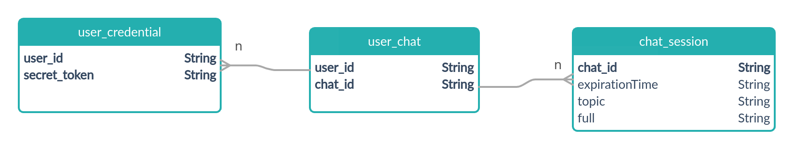
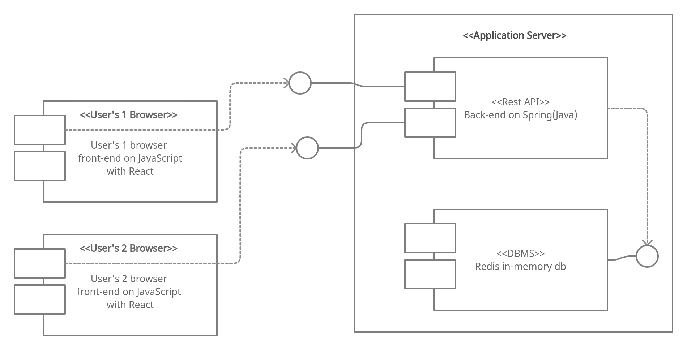
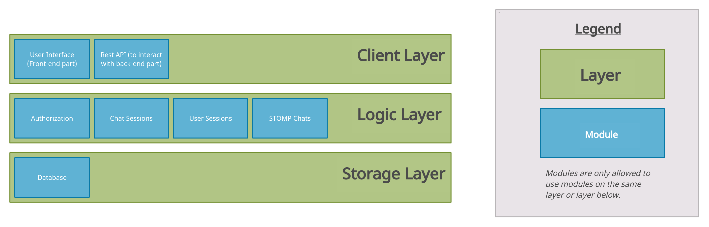
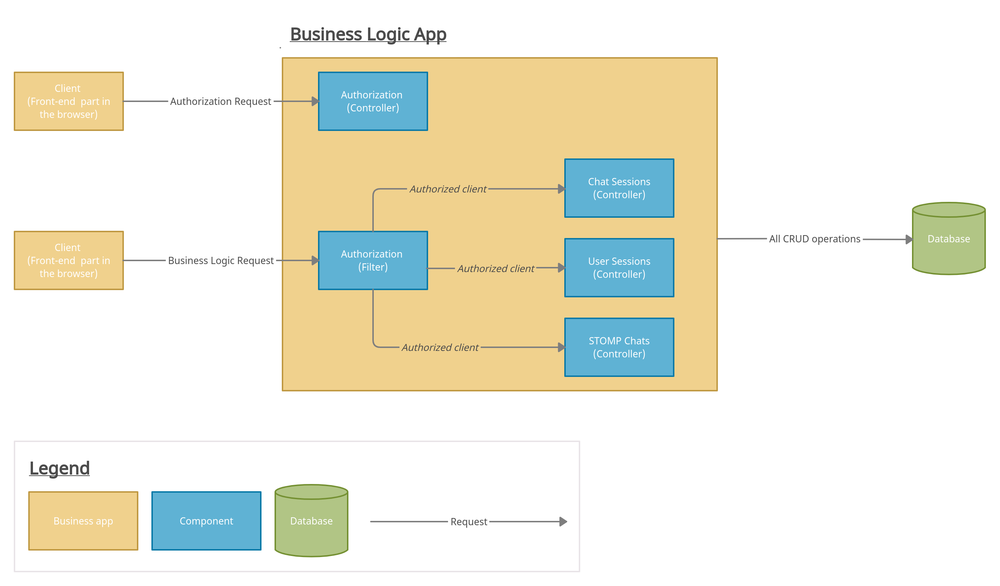
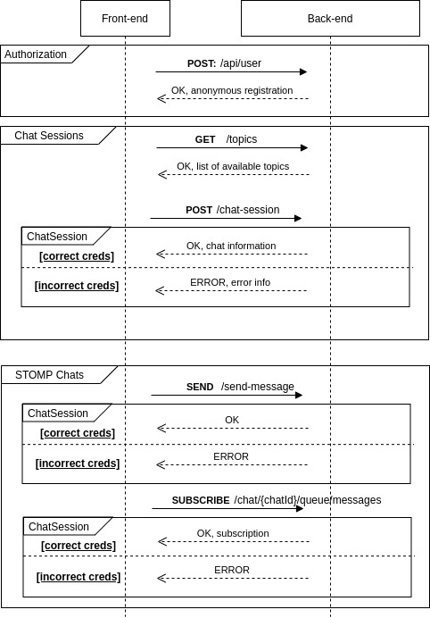

# Design Documentation
**Our project consists of 2 main parts: frontend and backend.**

Frontend is written on JavaScript with the use of React library. 
Backend is written on Java with the use of Spring framework. 
We decided to use libraries and frameworks for the project as they have a good architecture 
inside which was tested over long time.

## Design
### SOLID and Design Patterns
During the development process we followed SOLID principals. Also, we used some of the design patterns:
*Controller*(for end-points), *Builder*(for configuration) and *Interceptor*(for filtering the requests).

### Database Schema
For the database we use *Redis* as in-memory database which provides fast I/O operations.

### UML Deployment Diagram(Allocation View)
The following diagram shows on which physical units the software elements reside.

### Static View Diagram
The following diagram models concepts in the application domain, which is displayed in class diagrams.

### Dynamic View Diagram
The following diagram models concepts in the application domain, which is displayed in class diagrams.

### Sequence Diagram
The following diagram shows how and in what order a group of objects works together.
