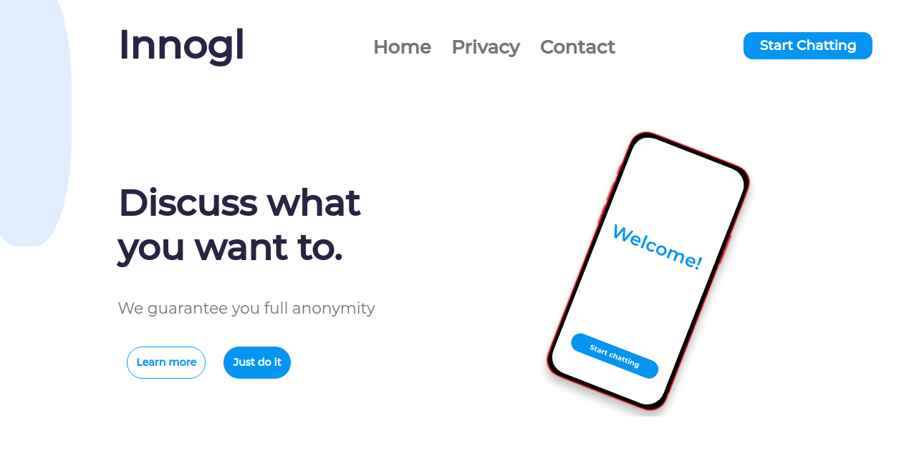

# Innogl
This project is an anonymous web and video chat with strangers. Users can choose an online companion to discuss anything, find new friends or discuss their problems. Besides, if they agree, they can turn on their cameras to see each other leaving disregarding anonymity. Users are able to add a specific topic which they want to discuss, and wait for someone to choose their own topic, on the other hand, they can take someone's topic to chat about in case they don't have specific ideas. If users don't prefer the previous options, they may choose a chat room randomly without a specific topic.

## Features
* Fully anonymous chat: we do not use your personal information. Your IP address in hidden to your
  companion, and we don't use or store it anywhere.
* Each chat is secured and has token-protection access. Token is unique for each session.
* The design of the frontend is adaptive and responsive: available on any device.
* The backend part of the project is written with the use of one of the best frameworks in Java - Spring.
* The frontend part of the project is written as reusable components with the use of React.
* Code id tested via unit and integration testing.
* Easy to run a project - it is inside Docker container.
* Video streaming will be available with the direct connection between 2 users.

## Demo

The demo video is available [https://youtu.be/NhGpJC8lPCA](https://youtu.be/NhGpJC8lPCA)!

## Running a project
### Firstly, you need to run backend part.
Please, check section `How to run` in the following guideline: [backend/README.md](backend/README.md)
### Finally, you need to run the frontend part.
Please, check section `How to run` in the following guideline: [frontend/README.md](frontend/README.md)

## How to use
After running on your local machine you should open the following link in your browser [http://localhost:3000/](http://localhost:8080/) and use it!

## Glossary
- **Spring** - one of the most famous frameworks for Java projects.
- **Application Programming Interface (API)** - an API is a well-defined interface through which two software applications can communicate with each other and abstract the inner workings.
- **Rest API** - an application programming interface (API or web API) that conforms to the constraints of REST architectural style and allows for interaction with RESTful web services.
- **Unit testing** - the process of testing individual units of code.
- **Integration testing** - the phase in software testing in which individual software modules are combined and tested as a group.

## Design documentation
You can read information about the design in the file [./Documentation.md](./Documentation.md).

## Requirements
You can read information about the requirements in the file [./Requirements.pdf](./Requirements.pdf).

## Code style
The code will be written using best practices of Spring and will be documented.

## Contribution
You can contribute in your project - we are glad to new ideas. Just open pull requests. However, be sure to follow our style guids for the code.

## Credits
This project is going to be written by [@mcflydesigner, backend dev](https://github.com/mcflydesigner), [@e2xen, backend dev](https://github.com/e2xen) and [@Khalil19-99, frontend dev](https://github.com/Khalil19-99).

## License
The project is released and distributed under [MIT License](https://en.wikipedia.org/wiki/MIT_License).
