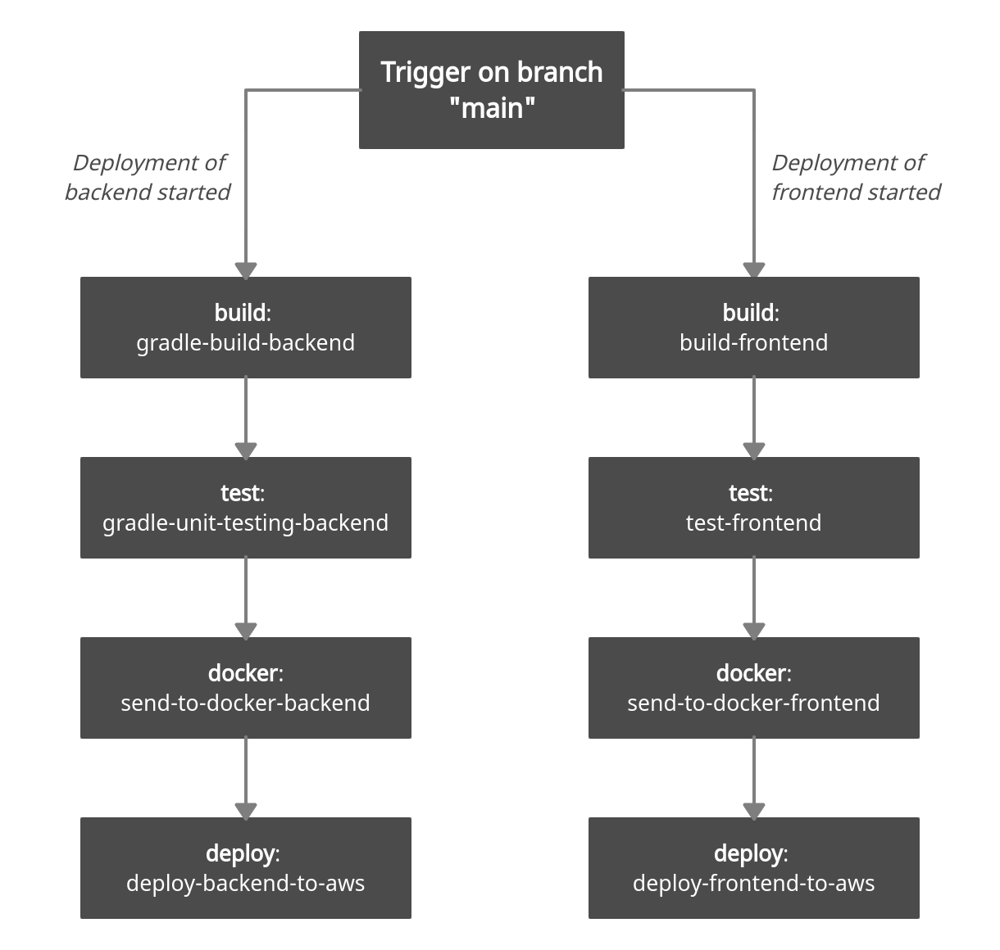

# Innogl
**The project is available now [http://setlyng.ru/](http://setlyng.ru/)!**

This project is an anonymous web and video chat with strangers. Users can choose an online companion to discuss anything, find new friends or discuss their problems. Besides, if they agree, they can turn on their cameras to see each other leaving disregarding anonymity. Users are able to add a specific topic which they want to discuss, and wait for someone to choose their own topic, on the other hand, they can take someone's topic to chat about in case they don't have specific ideas. If users don't prefer the previous options, they may choose a chat room randomly without a specific topic.

## Features
* Fully anonymous chat: we do not use your personal information. Your IP address in hidden to your
  companion, and we don't use or store it anywhere.
* Each chat is secured and has token-protection access. Token is unique for each session.
* The design of the frontend is adaptive and responsive: available on any device.
* The backend part of the project is written with the use of one of the best frameworks in Java - Spring.
* The frontend part of the project is written as reusable components with the use of React.
* Code id tested via unit and integration testing.
* Easy to run a project - it is inside Docker container.

## Goal and Tasks of the Project
The goal of the project is to deploy the application consisting of two main
parts (backend and frontend) Innogle on AWS via GitLab CI/CD and Docker
compose.

##  Execution plan and Methodology
Make a gitlab-ci.yml file, which will have the important stages and jobs
for the deployment.
* Implement the following stages in pipeline: building, testing, sending image to Docker Hub, deploying to AWS.
* Create and configure EC2 instances on AWS.
* Install and register GitLab runner on this EC2 instance.
* Use this GitLab Runner to run the CI/CD pipeline of gitlab-ci.yml file.
* Creating appropriate security groups for the instance, as a result, limiting
available ports to the external world.

## Demo

The demo video is available [via the link](https://drive.google.com/file/d/1Y8tzMVlMuqVh5v7vNtFLoZRTMrdPdN5c/view)!

## Running a project
### Firstly, you need to run backend part.
Please, check section `How to run` in the following guideline: [backend/README.md](backend/README.md)
### Finally, you need to run the frontend part.
Please, check section `How to run` in the following guideline: [frontend/README.md](frontend/README.md)

## How to use?
After running on your local machine you should open the following link in your browser [http://localhost:3000/](http://localhost:8080/) and use it!

*Or the project is already available here [http://setlyng.ru/](http://setlyng.ru/)!*

## CI/CD pipeline
Our CI/CD pipeline can be described by the following picture:

*Besides, the pipeline for frontend and backend are running in parallel to speed up the process of deployment of the
application.*

### Pipeline for backend
Our pipeline for backend consist of 4 different stages:
* Build stage - building Spring Java project using Gradle.
* Test stage - unit testing of our Java application using Junit.
* Docker stage - sending built via docker image to [our docker hub repository](https://hub.docker.com/repository/docker/mcflydesigner/innogl_backend).
* Deploy stage - deploying our backend application to the server via
SSH and running it as docker container.

### Pipeline for frontend
Our pipeline for frontend consist of 4 different stages:
* Build stage - building React project using *npm*.
* Test stage - unit testing of our application.
* Docker stage - sending built via docker image to [our docker hub repository](https://hub.docker.com/repository/docker/mcflydesigner/innogl_frontend).
* Deploy stage - deploying our frontend application to the server via
SSH and running it as docker container.

### How does pipeline work?
* When you push commit to main branch the following stages are run:
build, test, docker and deploy.
* When you do a merge request to main branch the following stages
are run: test.

## Report
You can read about deploying of Innogle application using Docker in the file [./SNA_report.pdf](./SNA_report.pdf).

## Design documentation
You can read information about the design in the file [./Documentation.md](./Documentation.md).

## Requirements
You can read information about the requirements in the file [./Requirements.pdf](./Requirements.pdf).

## Glossary
- **Spring** - one of the most famous frameworks for Java projects.
- **Application Programming Interface (API)** - an API is a well-defined interface through which two software applications can communicate with each other and abstract the inner workings.
- **Rest API** - an application programming interface (API or web API) that conforms to the constraints of REST architectural style and allows for interaction with RESTful web services.
- **Unit testing** - the process of testing individual units of code.
- **Integration testing** - the phase in software testing in which individual software modules are combined and tested as a group.

## Code 
We tried to write the code follow the recommendations from Spring community for backend(applied some design patterns), and from React community for frontend(we used reusable components, hooks, etc.).

We used style checkers to check the code:
* For frontend: *ESLint*
* For backend: *SonarLint*

## Tests
We developed unit and integration tests for backend and frontend parts, you can run them following the guidelines:
* `frontend/README.md`
* `backend/README.md`

## Contribution
You can contribute to our project - we are glad to new ideas. Just open pull requests. However, be sure to follow our style guids for the code.

## Credits
This project is developed by: 
* [@mcflydesigner, backend dev, devops](https://github.com/mcflydesigner) 
* [@e2xen, backend dev](https://github.com/e2xen)
* [@yadariya, backend_dev](https://github.com/yadariya)
* [@Khalil19-99, frontend dev, devops](https://github.com/Khalil19-99)

## License
The project is released and distributed under [MIT License](https://en.wikipedia.org/wiki/MIT_License).
