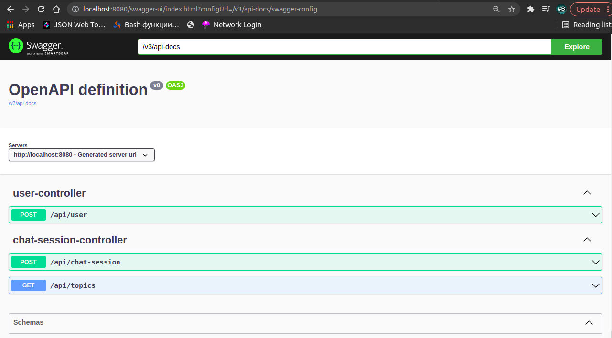

# Backend Innogl
This folder contains backend part of Innogl project.

## How to run
### Pre-installation
You should have pre-installed [Docker](https://docs.docker.com/engine/install/).

### Running a project
1. Pull this repo from github and navigate to **innogl/backend**:
```shell
 cd innogl/backend
```
2. Compose a docker image and run it
```
 docker-compose up
```
*Important:* for this step you need docker running in background.
#### Now you're up and running! Backend is accessible at a default 8080 port on your machine.

## API Documentation
We used *Auto Swagger(OpenAPI 3.0)* to automatically generate the documentation for endpoints.

For reference, if you are interested in an API provided by the backend, you may proceed to
[http://localhost:8080/swagger-ui/index.html?url=/v3/api-docs](http://localhost:8080/swagger-ui/index.html?url=/v3/api-docs)
after running the application in your browser.

*Or the documentation is available [here](http://setlyng.ru:8080/swagger-ui/index.html?url=/v3/api-docs)!*

